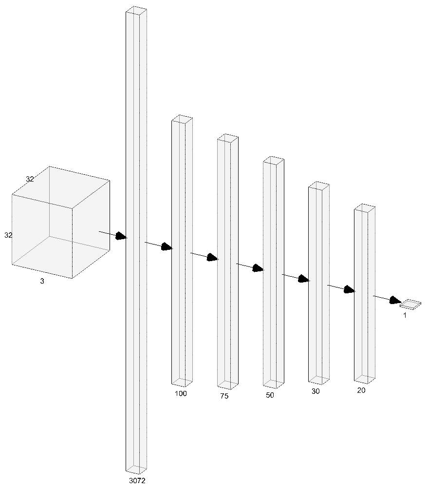

<style>
.math {
    <!-- font-size: 120%; -->
    font-style: normal;
    font-family: "Cambria Math";
}
.column {
    float: left;
    width: 50%;
    border: 1px solid black;
}
.row:after {
    content: "";
    display: table;
    clear: both;
}
.title, .toc-ignore {
    font-weight: bold;
    font-size: 120%;
    <!-- font-size: 100px; -->
}
.subtitle {
    font-style: italic;
    font-size: 20px;
    margin-left: 0px;
}
.header-section-number {
    margin-top: 40px;
    <!-- font-weight: bold; -->
    <!-- font-size: 40px; -->
}
h1 {
    margin-top: 40px;
    font-weight: bold;
    font-size: 30px;
}
h2 {
    margin-top: 40px;
    margin-left: 40px;
    font-size: 25px;
}
h3 {
    margin-top: 20;
    margin-left: 80px;
    font-size: 20px;
    font-style: italic;
}
</style>


# Introduction {#introduction}

Modern-day Data Science techniques frequently use robust frameworks for designing and building machine learning solutions. In the [`R`](https://www.r-project.org/) community, packages such as the [`tidyverse`](https://www.tidyverse.org/) and the [`caret`](http://caret.r-forge.r-project.org/) packages are frequently referenced; and within [`Python`](), packages such as [`numpy`](https://numpy.org/), [`pandas`](https://pandas.pydata.org/), [`sci-kit learn`](https://scikit-learn.org/) are frequently referenced. There are even some packages that have been built to be used in either language, such as [`keras`](https://keras.io/), [`pytorch`](https://pytorch.org/), [`tensorflow`](https://www.tensorflow.org/). However, the limitation of using these packages is the '_blackbox_' phenomenon, where users do not understand what is happening behind-the-scenes (or 'under the hood', if you will). Users know how to use the functions, and can interpret the results, but don't necessarily know how the packages were able to achieve the results.

The purpose of this paper is to create a 'back to basics' approach to designing Deep Learning solutions. The intention is not to create the most predictive model, nor is it to use the latest and greatest techniques (such as convolution or recursion); but the intention is to create a _basic_ neural network, from _scratch_, using _no_ frameworks, and to walk through the methodology.

**Note**: The word '_Vanilla_' in 'Vanilla Neural Networks' simply refers to the fact it is built from scratch, and does not use any pre-existing frameworks in its construction.

# Background {#background}

## Context {#context}

There are already many websites and blogs which explain how this process is done. Such as [Jason Brownlee](https://machinelearningmastery.com/about/)'s article [_How to Code a Neural Network with Backpropagation In Python (from scratch)_](https://machinelearningmastery.com/implement-backpropagation-algorithm-scratch-python/), and [DeepLearning.ai](https://notebooks.azure.com/goldengrape/projects/deeplearning-ai)'s notebook [_dnn_app_utils_v2.py_](https://notebooks.azure.com/goldengrape/projects/deeplearning-ai/html/COURSE%201%20Neural%20Networks%20and%20Deep%20Learning/Week%204/Deep%20Neural%20Network%20Application_%20Image%20Classification/dnn_app_utils_v2.py) (on the [Microsoft Azure Notebooks](https://notebooks.azure.com/) network). However, these sources are all written in `Python`. Which is fine, if that's what is needed, and there are some very legitimate reasons to use `Python` over other languages. But this paper will be written in `R`.

The `R` language was chosen for two reasons:

1. It is the language that I am familiar with. Noting that I can speak `Python` (along with other languages); I just chose `R` to show how it can be achieved using this language.
1. To prove that there are many different ways to achieve the same outcome. So, while there are sometimes legitimate constraints for choosing one language over another (business legacy, technological availability, system performance, etc), sometimes one language is chosen simply because it is stylistically more preferable.

Therefore, let's see how to architect and construct a Vanilla Neural Network in `R`.

## What It's Not {#whatitsnot}

This article does not cover the _latest_ and _greatest_ Deep Learning architectures (like [Convolution](https://www.tensorflow.org/tutorials/images/cnn) or [Recursion](https://www.tensorflow.org/guide/keras/rnn)). As such the final performance may not be as good as it _could_ be, if these architectures were used.

This article does not teach readers about the theoretical mathematical concepts behind _how_ Neural Networks operate. There are plenty of other lectures which teach this information (such as [The Math Behind Neural Networks](https://www.youtube.com/watch?v=RiqWATOoos8)). In fact, this article assumes a lot of knowledge from the Reader about programming, about calculus, and about the basics behind what a Neural Network conceptually is.

This article does not cover _why_ Neural Networks work the way they do, and the conceptual understanding behind a Feed-Forward architecture. There are plenty of other blogs (eg. [A Beginner Intro to Neural Networks](https://medium.com/@purnasaigudikandula/a-beginner-intro-to-neural-networks-543267bda3c8)) and videos (eg. [Neural Networks series](https://www.youtube.com/playlist?list=PLZHQObOWTQDNU6R1_67000Dx_ZCJB-3pi)) which cover such information.

This article does _not_ point the reader to other packages and applications which may already have this information set up and working. Packages like [`tensorflow`](https://www.rdocumentation.org/packages/tensorflow) and [`nnet`](https://www.rdocumentation.org/packages/nnet) already have this covered.

What this article _actually_ is, is a functional walk-through, how-to piece, for creating a Vanilla Neural Network (a Feed-Forward Network), from scratch, step-by-step, in the `R` programming language. It contains lots of code, and lots of 

# Semantics {#semantics}

## Layout {#layout}

This article is laid our in such a way to describe how a Neural Network is built from the ground-up. It will walk through the steps to:

1. Access and check the data
1. Instantiate and Initialise the network
1. Run forward propagation
1. Compute the cost
1. Run backward propagation
1. Update the model
1. Set up a training method to loop through every thing
1. Predict and assess the performance

In the interest of brevity, the functions defined here will not include all the commentary and validations that should be included in a function. They will only include basic steps and prompts. However, the source code for this article (located [here](https://github.com/chrimaho/VanillaNeuralNetworksInR/blob/master/Functions/functions.R)) does contain all the appropriate function docstrings and assertions.

## Syntax {#syntax}

For the most part, the syntax in this article is kept to the [`dplyr`](https://www.rdocumentation.org/packages/dplyr) 'pipe' method (which uses the `%>%` symbol). However, in certain sections the R [`base`](https://www.rdocumentation.org/packages/base) syntax is used (for example, in function declaration lines).

Throughout the article, many custom functions are written. Each of these are prefixed with the words `get`, `let` and `set`. The definitions of each are given below.

* `get_*()`:

    * It will `get` certain attributes of meta-data from the objects which are parsed to this function.
    * Or will use the information parsed to this function to derive and `get` other values or parameters.

* `set_*()`:

    * It will `set` (or 'update') the objects which are parsed to this function.
    * Is usually used for updating the network during forward and backward propagation processes.

* `let_*()`:

    * Similar to `get`, in that it takes other values parsed to this function to derive an outcome, however it will `let` this value be utilised by another object or function.
    * Used mainly for the initialisation and activation functions.

# Set Up {#setup}

## Load Packages {#loadpackages}

The first step is to import the relevant packages. This list includes the the main packages used throughout this process; and the main purpose of which is also listed.

Note what is listed above about not using existing Deep Learning packages, and yet the `tensorflow` package is included. Why? Well, this is used for only accessing the data, which will be covered in the next section. The `tensorflow` package is not used for building and training any networks.

```{r Load Packages, eval=TRUE, echo=TRUE, warning=FALSE, message=FALSE}
library(tensorflow)  #<-- Only used for getting the data. Nothing else
library(tidyverse)   #<-- Used for accessing various tools
library(magrittr)    #<-- Extends the `dplyr` syntax
library(grDevices)   #<-- For plotting the images
library(assertthat)  #<-- Function assertions
library(roxygen2)    #<-- Documentation is important
library(caret)       #<-- Doing data partitioning
library(stringi)     #<-- Some string manipulation parts
library(DescTools)   #<-- The only package that properly checks `is.integer`
library(tictoc)      #<-- Time how long different processes take
library(docstring)   #<-- Makes viewing the documentation a lot easier
library(roperators)  #<-- Conveniently using nifty functions like %+=%
```

```{r Set Defaults, eval=TRUE, echo=FALSE}
# Set Default themes
theme_set(theme_bw())
theme_update(
    plot.title = element_text(hjust=0.5),
    plot.subtitle = element_text(hjust=0.5)
)

# Set Default rounding length
options(digits = 4)
options(scipen = 999)

# Load functions
source("../Functions/functions.R")
```

# Get Data {#getdata}

## Download Data {#downloaddata}

The dataset to be used is the [CIFAR-10](https://www.cs.toronto.edu/~kriz/cifar.html) dataset. It's chosen for a number of reasons, including:

1. The data is on images, which is ideal for Deep Learning purposes;
1. There are a decent number of images included (60,000 images in total);
1. All images are the same the same size (32x32 pixels);
1. The images have been categorised in to 10 different classes; and
1. It's easily accessible through the `TensorFlow` package.

The following code chunk has the following process steps:

1. Get the data
    
    * In order to import the date, it is accessed through the `keras` element, which contains the suite of `datasets`, including the `cifar10` part.
    * The `load_data()` function retrieves the data from the online GitHub repository.
    
1. Extract the second element

    * The `load_package()` here returns two different objects:
        
        1. The train dataset (containing 50,000 images);
        1. The Test dataset (containing 10,000 images).
        
    * The second element is extracted (by using the `extract2()` function) because only 10,000 images are needed for these purposes.
    * This article is to show the _process_ of creating Vanilla Neural Networks; if more data is needed at a later stage, it can easily be accessed here.

1. Name the parts

    * The data as downloaded contains two further elements:
    
        1. The images themselves (in the form of a 4-Dimensional array);
        1. The image labels (in the form of a 2-Dimensional, single column array).
    
    * This data does not have any names, so therefore the names are set by using the `set_names()` function.

```{r Get Data, eval=TRUE, echo=TRUE, messages=FALSE, errors=FALSE}
# Download Data
cifar <- tf$keras$datasets$cifar10$load_data() %>% 
    extract2(2) %>% 
    set_names(c("images","classes"))
```

## Get Class Definitions {#getclassdefinitions}

One of the challenges behind accessing this data from the `tensorflow` package is that the classes are only numeric values (`0` to `9`) for each type of image. The definitions for these images can be found on GitHub ([EN10/CIFAR](https://github.com/EN10/CIFAR#classes)). These classes are defined in the following code chunk.

```{r Define Class List, eval=TRUE, echo=TRUE}
# Define classes
ClassList <- list(
    "0"="airplane",
    "1"="automobile",
    "2"="bird",
    "3"="cat",
    "4"="deer",
    "5"="dog",
    "6"="frog",
    "7"="horse",
    "8"="ship",
    "9"="truck"
)
```


# Check Data {#checkimages}

## Check Objects {#checkobjects}

It is important to check the data, to ensure that it has been generated correctly, and all the information looks okay. For this, a custom-function is written (`get_ObjectAttributes()`), the source code for which can be found [here](https://github.com/chrimaho/VanillaNeuralNetworksInR/blob/master/Functions/functions.R). As seen by the following code chunk, the `images` object is a 4-Dimensional numeric array, with `10,000` images, each `32x32` pixels, and `3` colour elements. The entire object is over `117 Mb` large.

```{r Check Images Data, eval=TRUE, echo=TRUE, message=FALSE, warning=FALSE}
# Check Images
cifar %>% 
    extract2("images") %>% 
    get_ObjectAttributes("cifar$images") %>% 
    cat()
```

When checking the `classes` object, it is a 2-Dimensional numeric array (with only 1 column), but with the same number of images as the `images` object (which is to be expected), with the frequency of each class label having exactly `1000` images each. The total size is less than `40 Kb`.

```{r Check Classes Data, eval=TRUE, echo=TRUE, message=FALSE, warning=FALSE}
# Check classes
cifar %>% 
    extract2("classes") %>% 
    get_ObjectAttributes(name="cifar$classes", print_freq=TRUE) %>% 
    cat
```

## Check Images

After having gained an appreciation of the size of the objects in memory, it is then worth while to check the actual images themselves. As humans, we understand the actual images and the colours, better than we understand the numbers.

In order to visualise the images, two custom functions are written, as shown in the following code chunk. These functions take in the data (as a 4-Dimensional array), and visualise the images as a plot.

```{r Function: Make Image, eval=FALSE, echo=TRUE}
set_MakeImage <- function(image, index=1) {
    #' @seealso https://stackoverflow.com/questions/32113942/importing-cifar-10-data-set-to-r#answer-39672323
    
    # Extract elements
    image.r <- image[,,1]
    image.g <- image[,,2]
    image.b <- image[,,3]
    
    # Make rgb
    image.rgb <- rgb(image.r, image.g, image.b, maxColorValue=255)
    
    # Fix dimensions
    dim(image.rgb) <- dim(image.r)
    
    # Return
    return(image.rgb)
}
```

```{r Function: Plot Image, eval=FALSE, echo=TRUE}
plt_PlotImage <- function(images, classes, index=1) {
    #' @seealso https://stackoverflow.com/questions/12918367/how-to-plot-with-a-png-as-background#answer-12918368
    
    # Slice images
    image <- images[index,,,]
    image %<>% set_MakeImage(index)
    lbl <- classes %>% extract(index) %>% as.character() %>% ClassList[[.]]
    
    # Create plot
    plot <- ggplot() + 
        ggtitle(lbl) +
        draw_image(image, interpolate=FALSE)
    
    # Return
    return(plot)
}
```

When the function is run on the top 16 images, the following is displayed. As shown, the images are extremely pixelated (which is expected, as they are only 32x32 pixels each), and you can see how each of the images are categorised.

```{r View Images, eval=TRUE, echo=TRUE, fig.width=12, fig.height=12}
# Set list
lst <- list()

# Loop 16 images
for (image in 1:16) {
    lst[[image]] <- plt_PlotImage(cifar$images, cifar$classes, image)
}

# View images
gridExtra::grid.arrange(grobs=lst, ncol=4)
```

# Prepare the Data {#prepdata}

There are four steps to preparing the data:

1. Reclassify
1. Split
1. Reshape
1. Standardise

## Reclassify {#reclassify}

For the purposes of this paper, let's assume that we are trying to predict whether or not the picture is a `car` or `not`. This will require transforming the data in to a binary classification problem, where the Neural Network will be looking to predict a `1` or a `0` our of the data. This will mean that the model output will be a probability distribution of scores, which can be easily classified by changing the `cutoff` variable.

First step is to reclassify the data so that all the cars have the value `1`, and everything else is `0`. We know from the classes we defined before that the car's already have the value `1`, which means the transformation will only need to occur for all the other classes.

```{r Reclassify Classes, eval=TRUE, echo=TRUE}
# Implement within a pipe
cifar[["classes"]] <- cifar %>%
    extract2("classes") %>% 
    (function(classes){
        
        # View initial classes
        classes %>% as.vector %>% head(40) %>% print
        
        # Reclassify
        classes <- ifelse(classes==1,1,0)
        
        # View reclassified classes
        classes %>% as.vector %>% head(40) %>% print
        
        # Return
        return(classes)
    })
```
## Split Data {#splitdata}

The next task is to split the data in to a training and testing set. The reason for doing this is covered elsewhere (such sites such as [Wikipedia's Cross-Validation](https://en.wikipedia.org/wiki/Cross-validation_%28statistics%29), and [Google's Machine Learning Crash Course: Training and Test Sets Splitting Data](https://developers.google.com/machine-learning/crash-course/training-and-test-sets/splitting-data)).

Firstly, to get an appreciation of the current split of the data, the following code chunk visualises this data using the `ggplot2` package. As show, the data is currently distributed with `90%` with the class `0`, and the remaining `10%` with the class `1`.

```{r Plot Original Classes, eval=TRUE, echo=TRUE}
cifar %>% 
    extract("classes") %>% 
    table(dnn="classes") %>% 
    data.frame() %>% 
    ggplot(aes(classes, Freq, fill=classes)) + 
        geom_col(colour="black") +
        geom_label(
            aes(label=Freq),
            show.legend=FALSE
        ) +
        scale_y_continuous(breaks=seq(0,10000,1000)) +
        theme(panel.grid.minor.y=element_blank()) +
        labs(
            title="Count of Each Class"
        )
```

To implement this data splitting, we are using the `caret::createDataPartition()` function. This creates a `partition` object, which is then used to segregate the `cifar` data accordingly. The proportion of splitting was arbitrarily chosen at `70%` for training, and the remaining for testing. However, it could be justified for this to be `80%`; this a is hyperparameter which can be tweaked at a later stage.

```{r Split Data, eval=TRUE, echo=TRUE}
# Set seed for reproducibility
set.seed(1234)

# Create partition
partition <- createDataPartition(cifar$classes, p=0.7, list=FALSE)

# Split data
trn_img <- cifar$images[partition,,,]
tst_img <- cifar$images[-partition,,,]
trn_cls <- cifar$classes[partition]
tst_cls <- cifar$classes[-partition]
```

After splitting, the data is re-plotted, and the train/test split is easily seen to have achieved an even `70%` distribution over the two classes.

```{r Plot Split Classes, eval=TRUE, echo=TRUE}
rbind(
    trn_cls %>% table,
    tst_cls %>% table
) %>% 
    set_rownames(c("train","test")) %>% 
    data.frame() %>% 
    rename_all(str_remove_all, "X") %>% 
    rownames_to_column("data") %>% 
    pivot_longer(2:3, names_to="classes", values_to="Freq") %>% 
    mutate(
        label=paste(data, classes, sep=": "),
        data=factor(data, levels=c("train","test"))
    ) %>% 
    ggplot(aes(classes, Freq, fill=data), position="dodge") + 
        geom_col(colour="black", position="dodge") +
        geom_label(
            aes(label=Freq), 
            position=position_dodge(width=0.9),
            show.legend=FALSE
        ) +
        scale_y_continuous(breaks=seq(0,10000,1000)) +
        theme(panel.grid.minor.y=element_blank()) +
        labs(
            title="Count of Each Class",
            subtitle="Split by Train/Test"
        )
```

Another method for checking that the data has been split properly, is to again run the `get_ObjectAttributes()` function, as shown in the following code chunk. The information shown here is consistent with the plot above. It is also interesting to note that the Training Image array is `82 Mb` large, which will be important to know for later checking the performance of forward propagation.

```{r Check Splitting, eval=TRUE, echo=TRUE}
for (name in c("trn_img","tst_img","trn_cls","tst_cls")) {
    get_ObjectAttributes(get(name), name, if (name %in% c("trn_cls","tst_cls")) TRUE else FALSE) %>% cat 
}
```

## Reshape Data {#reshapedata}

For the first `input` layer of our Neural Network, we want to be a single dimension of nodes. Therefore, it is necessary to reshape the data from a 4-Dimensional array in to a 2-Dimensional array. This can be done quite easily with the `array()` function, as it has the `dim=` argument which can be used to specify the dimensions required.

The desired matrix size should have each _image_ in a new row, and each _pixel_ on a different column. Because each pixel is comprised of the 2nd, 3rd and 4th dimensions, we need to take the _product_ of these three numbers, and use that to specify the desired number of columns. Effectively, we are running the equation: $32\times32\times3$, which equates to having $3072$ columns. This equation is implemented programmatically in-line, in the next code chunk.

```{r Reshape Data, eval=TRUE, echo=TRUE}
# Reshape data
trn_img %<>% array(dim=c(
    dim(.) %>% extract(1), 
    dim(.) %>% extract(2:4) %>% prod() 
))

tst_img %<>% array(dim=c(
    dim(.)[1], 
    dim(.)[2:4] %>% prod() 
))

trn_cls %<>% array(dim=c(
    length(.),
    1
))

tst_cls %<>% array(dim=c(
    length(.),
    1
))
```

When checking the object attributes once again, you will see that the image data has been manipulated correctly to have the number of rows as the number of images, and the number of columns as the number of pixels.

```{r Check Data Shapes, eval=TRUE, echo=TRUE}
for (name in c("trn_img","tst_img","trn_cls","tst_cls")) {
    get_ObjectAttributes(get(name), name, FALSE) %>% cat 
}
```

## Standardise Data {#standardisedata}

The final step to preparing the data is to standardise the data so that all the elements are between `0` and `1`. The reason for this is to prevent exploding and vanishing gradients in later steps, as the Neural Network will try to fit to all the peaks and troughs which is caused from having the data in a `0` to `255` value range.

As documented on the [TensorFlow](https://www.tensorflow.org/api_docs/python/tf/keras/datasets/cifar10/load_data) website, the [CIFAR10](https://www.cs.toronto.edu/~kriz/cifar.html) data set consists of RGB Image data. And, as documented on [Wikipedia](https://en.wikipedia.org/wiki/RGB_color_model), RGB data are all values between `0` and `255`.

Therefore, what is necessary to do is to divide all the elements by `255`, and they will inevitably result in a value between `0` and `1`. As the image data is currently in an array, the function in the below code chunk will run as a _vectorised function_ over the entire array, dividing all elements by 255 accordingly.

```{r Standardise Data, eval=TRUE, echo=TRUE}
trn_img <- trn_img/255
tst_img <- tst_img/255
```

The data is now ready for the network. Next step is to build the network.

# Instantiate the Network {#instantiatenetwork}

## Set the Architecture

Some quick notes on what the Network will _actually_ be:

* Overall architecture is a list.
* Each element of the master list is another list, and these are the layers of the network.
* The first layer will always be the `input` layer.
* The last layer will always be the `output` layer.
* Each of the layers in between will be the `hidden` layers, and the names for these layers are simply named with numbers.
* Each element of each layer will all be labelled the same, defined as follows:

    * `nodz` : Number of nodes in this layer. 
    * `inpt` : Input matrix. Aka `A_prev`. This is a duplicate of the activation of the previous layer, so for large networks this needs to be taken in to consideration. 
    * `wgts` : Weights matrix. Aka `W`. 
    * `bias` : Bias vector. Aka `b`. 
    * `linr` : Linear matrix. Aka `Z`. This is the result of the linear algebra between `inpt`, `wgts` and `bias`. 
    * `acti` : Activation matrix. Aka `A`. The result of applying an activation function to the `linr` matrix. 
    * `acti_func` : The activation function used. 
    * `cost` : The overall cost of the model. This is a single value (the overall cost of the model), but is copied to each layer of the model. 
    * `back_cost` : Gradient of the cost vector. Aka `dA_cost`. 
    * `back_acti` : Gradient of the Activation matrix. Aka `dA`. The result of differentiation after having applied back propagation. With a given cost function. 
    * `back_linr` : Gradient of the Linear algebra matrix. Aka `dZ`. The result of backwards linear differentiation back propagation. 
    * `back_wgts` : Gradient of the Weights matrix. Aka `dW`. Also the result of back-prop. 
    * `back_bias` : Gradient of the Bias vector. Aka `db`. Also the result of back-prop. 

### Set the function

For the below code chunk, the function `set_InstantiateNetwork()` is defined. It only has three input arguments, which specify the number of nodes to be used in each layer. Based on this information, the model will be instantiated and returned, ready for initialisation, in the next step.

```{r Instantiate Network Definition, eval=FALSE, echo=TRUE}
set_InstantiateNetwork <- function(input=50, hidden=c(30,20,10), output=1) {

    # Set up
    model = list()
    layers = c(
        "input",
        1:length(hidden),
        "output"
    )
    
    # Loop
    for (layer in layers) {
        
        # Make layer
        model[[layer]] <- list(
            "nodz"      = "",
            "inpt"      = "",
            "wgts"      = "",
            "bias"      = "",
            "linr"      = "",
            "acti"      = "",
            "acti_func" = "",
            "cost"      = "",
            "back_cost" = "",
            "back_acti" = "",
            "back_linr" = "",
            "back_wgts" = "",
            "back_bias" = "" 
        )
        
        # Set nodes
        if (layer=="input") {
            model[[layer]][["nodz"]] = input
        } else if (layer=="output") {
            model[[layer]][["nodz"]] = output
        } else {
            layer_index = layer %>% as.numeric()
            model[[layer]][["nodz"]] = hidden[layer_index]
        }
        
    }
    
    # Return
    return(model)
}
```

### Create the Network

The below code chunk instantiates the network. The model will be set up with the following number of nodes in each layer:

* The `input` layer will have `3072` nodes, the same number calculated above.
* Each `hidden` layer will have a decreasing number of nodes, from `100` down to `20` notes.
* The `output` layer will have 1 node, because this one node will be a floating point number betwee `0` and `1`, which will be used to predict whether the relevant image is a `car` or `not`.

```{r Instantiate Network, eval=TRUE, echo=TRUE}
network_model <- set_InstantiateNetwork(
    input=3072, 
    hidden=c(100,75,50,30,20), 
    output=1
)
```

### Visualise the Network

There is a very good website available which allows Neural Networks to be visualised: [http://alexlenail.me/NN-SVG/AlexNet.html](http://alexlenail.me/NN-SVG/AlexNet.html). The below image is a representation of the network that has just been created.



# Initialise the Network {#initialisenetwork}

There are four steps to initialising the network:

1. Set the Weight Initialisation functions
1. Set the Layer Initialisation function
1. Set the Model Initialisation function
1. Run the Initialisation

## Weight Initialisation

At it's core, weight initialisation is simply generating a random normal number (with $\mu=0$ and $\sigma=1$). However, by only using this randomly generated number, the model gradients are found to be exploding or vanishing when attempting to train deeper neural networks. Therefore, these weights need to be scaled after they are initialised, in order to be robust enough to continue to be trained at deeper layers.

There are many algorithms that can be used for weight initialisation. Two of the more common ones are the Xavier algorithm, and the He algorithm. Some good resources for understanding the details behind these algorithms include:

* [Weight Initialization in Neural Networks](https://towardsdatascience.com/weight-initialization-in-neural-networks-a-journey-from-the-basics-to-kaiming-954fb9b47c79)
* [Understanding the difficulty of training deep feedforward neural networks](http://proceedings.mlr.press/v9/glorot10a/glorot10a.pdf)
* [Surpassing Human-Level Performance on ImageNet Classification](https://arxiv.org/pdf/1502.01852.pdf)

### Xavier Algorithm

The equation for the Xavier initialisation is:

$$
\pm\sqrt{\frac{6}{n_i+n_{i+1}}}
$$
Where:

* $n_i$ is the number of nodes coming in to this layer. Also known as "fan-in".
* $n_{i+1}$ is the number of nodes going out of this layer. Also known as "fan-out".

### He Algorithm

The equation for the He initialisation is:

$$
\pm\sqrt{\frac{2}{n_i}}
$$

Where: 

* $n_i$ is the number of nodes coming in to this layer.

### The Functions

For programmatic purposes, these functions are written with the `order` value as part of the function arguments. This means that the order of magnitude of the equation can be altered at a later stage and used as a hyperparameter.

```{r Xavier Initialisation, eval=TRUE, echo=TRUE}
let_InitialiseXavier <- function(nodes_in, nodes_out, order=6) {
    
    # Do work
    numer <- sqrt(order)
    denom <- sqrt(nodes_in + nodes_out)
    output <- numer/denom
    
    # Return
    return(output)
}
```

```{r He Initialisation, eval=TRUE, echo=TRUE}
let_InitialiseHe <- function(nodes_in, nodes_out, order=2) {
    
    # Do work
    numer <- order
    denom <- nodes_in
    output <- sqrt(numer/denom)
    
    # Return
    return(output)
}
```

## Layer Initialisation

The next step is to construct a function that will initialise all the relevant aspects of an individual layer. This step is important because it is where the weight matrices are created, and these must be constructed in a certain manner so as to ensure that the dimensions allow successful forward propagation.

The steps for the layer construction are as follows:

1. Determine the layer names of current layer (`layer`) and of the previous layer (`layer_prev`).
    * Used to access the relevant configurations from the `network_model` list.
1. Determine the number of nodes feeding in to this layer (`nodes_in`), and the number of nodes feeding out of the current layer (`nodes_out`).
    * Used for parse'ing in to the Initialisation Algorithms.
1. Create the Weight matrix.
    * The dimensions of which are as follows:
        * Number of Rows is the number of nodes in the previous layer.
        * Number of Columns is the number of nodes in the current layer.
    * Each element is created using the `rnorm()` function, which generates a random number on the normal curve, with $\mu=0$ and $\sigma=1$.
1. Determine the Initialisation Algorithm to be used.
    * The value value parsed in to this function is a lower-case word associated with the relevant algorithm.
    * It is coerced to a Title capitalisation, and then given the prefix `let_Initialisation`.
    * The value is then parsed in to the `get()` function, which then calls the function, and executes the parameters parsed to it.
    * This is a programmatic way to flexibly call different algorithms, based on values parsed to the function.
1. Scale the Weight matrix.
    * By multiplying each element by the Initialisation Algorithm.
1. Create the Bias matrix.
    * The dimensions of which are as follows:
        * The number of rows is the number of nodes in the current layer.
        * There is only one column.
    * Every single element has value `0`.
1. Apply the Weight and Bias matrix back on to the `network_model`.
1. Return the updated `network_model` object.

In order to achieve this, the function arguments used are for the function include:

1. The `network_model` itself.
1. The `layer_index` of the layer (where $1$ is the `input` layer, and each increasing number is each subsequent layer).
1. The `initialisation_algorithm`, which is either the value `NA`, or the value `xavier` or `he` which is the value of the relevant algorithm.
1. The `initialisation_order`, which is an integer value to be used as the numerator in the relevant algorithm.

```{r Layer Initialisation, eval=TRUE, echo=TRUE}
set_InitialiseLayer <- function(network_model, 
                                layer_index, 
                                initialisation_algorithm=NA, 
                                initialisation_order=6
                                ) {
    
    # Get layer names
    layer_prev <- names(network_model)[layer_index-1]
    layer <- names(network_model)[layer_index]
    
    # Get number of nodes
    if (layer_index == 1) {
        nodes_in <- 0 #First layer is 'input'; therefore, there are 0 nodes feeding in to it.
    } else {
        nodes_in <- network_model %>% extract2(layer_prev) %>% extract2("nodz")
    }
    nodes_out <- network_model %>% extract2(layer) %>% extract2("nodz")
    
    # Set the seed of reproducibility
    set.seed(1234)
    
    # Initialise weight matrix
    w_matrix <- matrix(
        data=rnorm(nodes_in * nodes_out), 
        nrow=nodes_in,
        ncol=nodes_out
    )
    
    # Get initialisation algorithm
    if (!is.na(initialisation_algorithm)) {
        algorithm <- paste0("let_Initialise", str_to_title(initialisation_algorithm))
    }
    
    # Scale weights
    if (layer_index != 1) {
        if (is.na(initialisation_algorithm)) {
            w_matrix <- w_matrix
        } else {
            w_matrix <- w_matrix * 
                get(algorithm)(
                    nodes_in=nodes_in, 
                    nodes_out=nodes_out, 
                    order=initialisation_order
                )
        }
    }
    
    # Initialise bias matrix
    b_matrix <- matrix(
        data=network_model %>% extract2(layer) %>% extract2("nodz") %>% replicate(0),
        nrow=network_model %>% extract2(layer) %>% extract2("nodz"),
        ncol=1
    )
    
    # Place data back in to the model
    network_model[[layer]][["wgts"]] <- w_matrix
    network_model[[layer]][["bias"]] <- b_matrix
    
    # Return
    return(network_model)
}
```

## Model Initialisation

The purpose of the `set_InitialiseModel()` function is to loop through each layer in the `network_model` object, to initialise them in accordance with the parameters set within the model itself. This function will take the number of nodes (set by the `set_InstantiateNetwork()` function).

The function will take only three input parameters:

1. The `network_model`:
    * The Network, as instantiated by the `set_InstantiateNetwork()` function.
1. The `initialisation_algorithm`:
    * The algorithm to be used for the network initialisation.
    * This should be the values `NA`, `xavier`, or `he`.
1. The `initialisation_order`:
    * The order value to be used for the numerator of the equation.
    * This could be a numeric value, or the string `layers` which signifies that the order should be the number of hidden layers in the network.

```{r Model Initialisation, eval=TRUE, echo=TRUE, warning=FALSE}
set_InitialiseModel <- function(network_model, 
                                initialisation_algorithm="xavier", 
                                initialisation_order="layers"
                                ) {
    
    # Redefine 'initialisation_order'
    if (initialisation_order == "layers") {
        initialisation_order <- get_CountOfElementsWithCondition(
            names(network_model), 
            function(x){is.integer(as.numeric(x))}
        )
    }
    
    # Initialise each layer
    for (layer_index in 1:length(names(network_model))) {
        network_model <- set_InitialiseLayer(
            network_model=network_model, 
            layer_index=layer_index, 
            initialisation_algorithm=initialisation_algorithm,
            initialisation_order=initialisation_order
        )
    }
    
    # Return
    return(network_model)
}
```

Notice, this function uses the user-defined function `get_CountOfElementsWithCondition()`. This function allows for the counting of the number of hidden layers in the model. The source code for the function can be found [here](https://github.com/chrimaho/VanillaNeuralNetworksInR/blob/master/Functions/functions.R).

## Initialise the Network

The below code chunk initialises the network using the function defined above. The method utilised is `%<>%`, which is defined in the `magrittr` package, which states that it is used to update a value on the left-hand side by first piping it into the first argument position on the right-hand side, and then assigning the result back to the object on the left hand side.

```{r Run the Setup, eval=TRUE, echo=TRUE}
network_model %<>% set_InitialiseModel()
```

## Check the Model Parameters

For a quick sanity-check, the below code chunk checks for the number of parameters for the defined model. This again uses a custom function `get_ModelParametersCount()`, the definition for which can be found in the source code for this article (located [here](https://github.com/chrimaho/VanillaNeuralNetworksInR/blob/master/Functions/functions.R)).

```{r}
network_model %>% 
    get_ModelParametersCount() %>% 
    format(big.mark=",")
```

# Forward Propogation

## The Theory

There is a very good website which outlines what actually happens during a matrix manipulation: [Matrix Manipulation](http://matrixmultiplication.xyz/).

The theory for the forward propagation method is as follows:

1. Apply matrix manipulation
    1. The first matrix is the activation matrix from the previous layer.
    1. The second matrix is the weight matrix for the current layer.
    1. The third matrix is the (first) linear activation matrix for the current layer.
1. Apply bias matrix
    1. The first matrix is the (first) linear activation of the current layer.
    1. The second matrix is the bias matrix for the current layer.
    1. The third matrix is the (second) linear activation matrix for the current layer.
1. Apply activation algorithm
    1. The first matrix is the (second) linear activation matrix for the current layer.
    1. The activation function is determined by the user during the time of the function being run. Can be the `relu` activation, `sigmoid` activation, or any of the other activation functions.
    1. The third matrix is the  activation matrix for the current layer.

### Step One

To illustrate, the following matrices shows the first step of the forward propagation, using fictitious numbers.

$$
\begin{bmatrix}
 1 &  2 &  3 \\
 4 &  5 &  6 \\
 7 &  8 &  9 \\
10 & 11 & 12 \\
13 & 14 & 15 \\
16 & 17 & 18 \\
19 & 20 & 21 \\
22 & 23 & 24 \\
\end{bmatrix}\times\begin{bmatrix}
1  & 2  & 3  & 4  &  5 \\
6  & 7  & 8  & 9  & 10 \\
11 & 12 & 13 & 14 & 15 \\
\end{bmatrix}=\begin{bmatrix}
 46 &  52 &  58 &  64 &  70 \\
100 & 115 & 130 & 145 & 160 \\
154 & 178 & 202 & 226 & 250 \\
208 & 241 & 274 & 307 & 340 \\
262 & 304 & 346 & 388 & 430 \\
316 & 367 & 418 & 469 & 520 \\
370 & 430 & 490 & 550 & 610 \\
424 & 493 & 562 & 631 & 700 \\
\end{bmatrix}
$$

The below code shows how this process is implemented programatically.

```{r, eval=TRUE, echo=TRUE}
# Declare First matrix
mat_a <- matrix(
    data=1:24, 
    nrow=8, 
    ncol=3, 
    byrow=TRUE
)

# Declare Weight matrix
mat_b <- matrix(
    data=1:15, 
    nrow=3, 
    ncol=5, 
    byrow=TRUE
)

# Apply matrix manipulation
mat_c <- mat_a %*% mat_b
```
```{r, eval=TRUE, echo=FALSE}
writeLines("mat_a:")
mat_a
writeLines("\nmat_b:")
mat_b
writeLines("\nmat_c:")
mat_c
```

### Step Two

The next diagram shows how the bias matrix is applied. As shown, each element in the bias matrix is applied horizontally to each element of the initial matrix. This diagram shows how it works.

$$
\begin{bmatrix}
 46 &  52 &  58 &  64 &  70 \\
100 & 115 & 130 & 145 & 160 \\
154 & 178 & 202 & 226 & 250 \\
208 & 241 & 274 & 307 & 340 \\
262 & 304 & 346 & 388 & 430 \\
316 & 367 & 418 & 469 & 520 \\
370 & 430 & 490 & 550 & 610 \\
424 & 493 & 562 & 631 & 700 \\
\end{bmatrix}+\begin{bmatrix}
1 \\
2 \\
3 \\
4 \\
5 \\
6 \\
7 \\
8 \\
\end{bmatrix}=\begin{bmatrix}
 47 &  53 &  59 &  65 &  71 \\
102 & 117 & 132 & 147 & 162 \\
157 & 181 & 205 & 229 & 253 \\
212 & 245 & 278 & 311 & 344 \\
267 & 309 & 351 & 393 & 435 \\
322 & 373 & 424 & 475 & 526 \\
377 & 437 & 497 & 557 & 617 \\
432 & 501 & 570 & 639 & 708 \\
\end{bmatrix}
$$

The below code shows how this process is implemented programatically.

```{r, eval=TRUE, echo=TRUE}
# Declare Bias matrix
mat_d <- matrix(1:8, 8, 1)

# Apply Bias matrix
mat_e <- sweep(mat_c, 1, mat_d, "+")
```
```{r, eval=TRUE, echo=FALSE}
writeLines("mat_c:")
mat_c
writeLines("\nmat_d:")
mat_d
writeLines("\nmat_e:")
mat_e
```

### Step Three

The activation function is one which is defined at the time of running the function. The algorithm is applied to each element of the initial matrix. In this instance, a simple multiplication of the initial matrix is matrix.

$$
\begin{bmatrix}
 47 &  53 &  59 &  65 &  71 \\
102 & 117 & 132 & 147 & 162 \\
157 & 181 & 205 & 229 & 253 \\
212 & 245 & 278 & 311 & 344 \\
267 & 309 & 351 & 393 & 435 \\
322 & 373 & 424 & 475 & 526 \\
377 & 437 & 497 & 557 & 617 \\
432 & 501 & 570 & 639 & 708 \\
\end{bmatrix}\times\delta=\begin{bmatrix}
  22.09 &   28.09 &   34.81 &   42.25 &   50.41 \\
 104.04 &  136.89 &  174.24 &  216.09 &  262.44 \\
 246.49 &  327.61 &  420.25 &  524.41 &  640.09 \\
 449.44 &  600.25 &  772.84 &  967.21 & 1183.36 \\
 712.89 &  954.81 & 1232.01 & 1544.49 & 1892.25 \\
1036.84 & 1391.29 & 1797.76 & 2256.25 & 2766.76 \\
1421.29 & 1909.69 & 2470.09 & 3102.49 & 3806.89 \\
1866.24 & 2510.01 & 3249.00 & 4083.21 & 5012.64 \\
\end{bmatrix}
$$

The below code shows how this process is implemented programatically.

```{r, eval=TRUE, echo=TRUE}
# Apply Activation function
mat_f <- mat_e*(0.01*mat_e)
```
```{r, eval=TRUE, echo=FALSE}
writeLines("mat_e:")
mat_e
writeLines("\nmat_f:")
mat_f
```

## Linear Component

When combined together, the linear algebraic function is implemented in just three lines of code, as shown in the below code chunk in the `set_LinearForward()` function.

```{r}
set_LinearForward <- function(inpt, wgts, bias) {
    
    # Perform matrix multiplication
    linr <- inpt %*% wgts
    
    # Add bias
    linr <- sweep(linr, 2, bias, "+")
    
    # Return
    return(linr)
}
```

## Non-Linear Component

The real power of Neural Network comes from their Activation function. It is now the network is able to capture the non-linear aspects, and this is what emphasises their predictive power.

The Activation function can be one of many different algorithms, depending on the purpose of the network. The choice of Activation can be a hyperparameter which is chosen at a later stage. The [Desmos](https://www.desmos.com/) website provides an excellent interactive way of reviewing the different types of Activations: [Activation Functions](https://www.desmos.com/calculator/rhx5tl8ygi).

Each of the Activation functions are defined individually, and each only take one argument for the function, which is a matrix for which the activation will be applied. For the purposes of brevity, four of the more popular activations are provided here; but there are many, many others which can be used. The resources and equations for how to compute these functions are also provided:

* `sigmoid`:
    * $\sigma(x)=\frac{1}{1+e^{-x}}$
    * [How to calculate a logistic sigmoid function in Python](https://kite.com/python/answers/how-to-calculate-a-logistic-sigmoid-function-in-python)
    * [Implement sigmoid function using Numpy](https://www.geeksforgeeks.org/implement-sigmoid-function-using-numpy/)
* `relu`:
    * $r(x)=max(0,x)$
    * [A beginner’s guide to NumPy with Sigmoid, ReLu and Softmax activation functions](https://medium.com/ai%C2%B3-theory-practice-business/a-beginners-guide-to-numpy-with-sigmoid-relu-and-softmax-activation-functions-25b840a9a272)
* `softmax`:
    * $f(x)=\frac{exp(x_j)}{\Sigma_j exp(x_j)}$
    * [Softmax Activation Function Explained](https://towardsdatascience.com/softmax-activation-function-explained-a7e1bc3ad60)
* `swish`:
    * $s(x)=x \cdot f(\beta \cdot x)$
    * [Searching for Activation Functions](https://arxiv.org/pdf/1710.05941.pdf)
    * [Implementing Swish Activation Function in Keras](https://www.bignerdranch.com/blog/implementing-swish-activation-function-in-keras/)

```{r}
let_ActivateSigmoid <- function(linr) {
    
    # Do work
    acti <- 1/(1+exp(-linr))
    
    # Return
    return(acti)
}
```
```{r}
let_ActivateRelu <- function(linr) {
    
    # Do work
    acti <- sapply(linr, max, 0) %>% 
        structure(dim=dim(linr))
    
    # Return
    return(acti)
}
```
```{r}
let_ActivateSoftmax <- function(linr) {
    
    # Do work
    expo <- exp(linr)
    expo_sum <- sum(exp(linr))
    acti <- expo/expo_sum
    
    # Return
    return(acti)
}
```
```{r}
let_ActivateSwish <- function(linr, beta=0.1) {
    
    # Do work
    acti <- linr * (beta * linr)
    
    # Return
    return(acti)
}
```

## Forward Prop

The `set_ForwardProp()` function pulls together all of the components mentioned above. It implements the following steps:

1. Loop through each layer of the `network_model`.
1. Get the layer name for the current layer.
1. Implement a 'pass-thru' process for the `input` layer.
1. Extract the relevant information, including:
    1. Layer name of the _previous_ layer
    1. Activation matrix of the _previous_ layer
    1. Weights matrix of the _current_ layer
    1. Bias matrix for the _current_ layer
1. Apply linear algebra component.
1. Apply the non-linear activation component.
    1. Note the difference between the activation of the hidden layers and that of the final layer.
1. Apply the relevant information back on to the network.
1. Return the `network_model` object.

In order to implement this process, the function takes only four arguments:

1. `network_model`: The network model to be updated.
1. `data_in`: The 4-Dimensional array of training images, as defined above.
1. `activation_hidden`: The Activation function to be applied to the hidden layers.
1. `activation_sigmoid`: The Activation function to be applied to the final (`output`) layer.

```{r}
set_ForwardProp <- function(network_model, 
                            data_in, 
                            activation_hidden="relu", 
                            activation_final="sigmoid"
                            ) {
    
    # Do work
    for (index in 1:length(names(network_model))) {
        
        # Define layer name
        layr <- names(network_model)[index]
        
        if (layr=="input") {
            
            # Pass-thru for 'input' layer
            network_model[[layr]][["inpt"]] <- data_in
            network_model[[layr]][["acti"]] <- data_in
            
        } else {
            
            # Extract data
            prev <- names(network_model)[index-1]
            inpt <- network_model[[prev]][["acti"]]
            wgts <- network_model[[layr]][["wgts"]]
            bias <- network_model[[layr]][["bias"]]
            
            # Calculate
            linr <- set_LinearForward(inpt, wgts, bias)
            
            # Activate
            if (layr=="output") {
                acti <- get(paste0("let_Activate",str_to_title(activation_final)))(linr)
                network_model[[layr]][["acti_func"]] <- activation_final
            } else {
                acti <- get(paste0("let_Activate",str_to_title(activation_hidden)))(linr)
                network_model[[layr]][["acti_func"]] <- activation_hidden
            }
            
            # Apply back to our model
            network_model[[layr]][["inpt"]] <- inpt
            network_model[[layr]][["linr"]] <- linr
            network_model[[layr]][["acti"]] <- acti
            
        }
        
    }
    
    # Return
    return(network_model)
}
```

## Run

The last step of the Forward Propagation process is to actually run the function. In the below code chunk, the `tic()` and `toc()` functions are implemented to time how long a process takes to run.

```{r}
tic()
network_model <- set_ForwardProp(network_model, trn_img, "relu", "sigmoid")
toc()
```

As mentioned above in the [Split Data](#splitdata) section, the `trn_img` object is over `82 Mb` large. The entire end-to-end process for forward propagation took only `3 seconds` to run; which is quite impressive, and is a testament to the power of mathematics.

# Calculate the Cost

Once the forward-propagation part has been completed, it's then necessary to get a measure for how wrong the model is. This will then be used to update the model parameters during the backward propagation steps.

## Set Up

The first step is to write the functions to be used for getting the cost for the model. Ultimately, it does not matter how bad the results are for the first round of training; remember, the model was initialised with random numbers. What's important is that the cost functions should be determining a _single_ value for the cost of the network, and this single function will be what is used for the derivative functions to be used in the backwards propagation steps.

Note here, that there is a very small epsilon value used (`epsi`), which effectively adjusts for a perfect prediction made by the model. The reason for this is not that we don't want the model to predict a perfect value, it's that we want the model to predict the probability of a perfect value. Furthermore, it's impossible to take a logarithmic value of a $0$, so therefore it's necessary to adjust this to be _just_ a little bit off-zero.

```{r}
get_ComputeCost <- function(pred, true, epsi=1e-10) {
    
    # Get number of samples
    samp <- length(true)
    
    # Instantiate totals
    total_cost <- 0
    
    # Loop for each prediction
    for (i in 1:samp) {
        
        # Adjust for perfect predictions.
        if (pred[i]==1) {pred[i] %<>% subtract(epsi)}
        if (pred[i]==0) {pred[i] %<>% add(epsi)}
        
        # Calculate totals
        total_cost <- total_cost - ((true[i] * log(pred[i]) + (1-true[i]) * log(1-pred[i])))
        
    }
    
    # Take an average
    cost <- (1/samp) * total_cost
    
    # Return
    return(cost)
}
```

Then, the cost must be applied back on to the network. For this, the exact same value is applied to each layer of the network.

```{r}
set_ApplyCost <- function(network_model, cost) {
    
    # Apply back to the model
    for (layer in network_model %>% names) {
        network_model[[layer]][["cost"]] <- cost
    }
    
    # Return
    return(network_model)
}
```

## Run the Cost Functions

The below code chunk runs the cost functions, utilising the functions defined above.

```{r}
network_model <- set_ApplyCost(
    network_model, 
    get_ComputeCost(network_model[["output"]][["acti"]], trn_cls)
)
```

# Backward Propogation

The function of back-propagation is intended to take the cost of the model, and then differentiate each of the Weights and Biases matrices in the network to determine to what extent each and every single parameter in the network contributed to that final cost value. To do this, the process works backwards from the end to the start, following the following steps:

1. Differentiate the final cost value
1. Differentiate the activation matrices
1. Differentiate the linear algebra matrices
1. Continue to the previous layer.

Each step in the back-propagation process requires calculus to derive the values, and the final function is implemented here. As this paper is not intended to show how to derive the equations, but more how to run the functions, the necessary algebraic steps are not included here.

## Differentiate Cost

As similar to the functions used to get the cost, the cost differential values are first calulated, then applied to each layer of the network.

```{r}
get_DifferentiateCost <- function(pred, true) {
    
    # Do work
    diff_cost <- -(divide_by(true, pred) - divide_by(1-true, 1-pred))
    
    # Return
    return(diff_cost)
}
```

```{r}
set_ApplyDifferentiateCost <- function(network_model, cost_differential) {
    
    # Do work
    for (layer in names(network_model)) {
        network_model[[layer]][["back_cost"]] <- cost_differential
        if (layer=="output") {
            network_model[[layer]][["back_acti"]] <- network_model[[layer]][["back_cost"]] %>% t()
        }
    }
    
    # Return
    return(network_model)
}
```

```{r}
network_model <- set_ApplyDifferentiateCost(
    network_model, 
    get_DifferentiateCost(network_model[["output"]][["acti"]],trn_cls)
)
```

## Differentiate Activation


```{r}
let_BackwardActivateRelu <- function(diff_acti_curr, linr_curr) {
    
    # Do work
    diff_linr_curr <- diff_acti_curr
    diff_linr_curr[linr_curr<=0] <- 0
    
    # Return
    return(diff_linr_curr)
}
```
```{r}
let_BackwardActivateSigmoid <- function(diff_acti_curr, linr_curr) {
    
    # Do work
    temp <- 1/(1+exp(-linr_curr))
    diff_linr_curr <- t(diff_acti_curr) * temp * (1-temp)
    
    # Return
    return(t(diff_linr_curr))
}
```

## Differentiate Linear

```{r}
get_DifferentiateLinear <- function(back_linr_curr, acti_prev, wgts, bias) {
    
    # get number of samples
    samp <- acti_prev %>% dim %>% extract(2)
    
    # Differentiate weights
    diff_wgts <- 1/samp * (back_linr_curr %*% acti_prev)
    
    # Differentiate bias
    diff_bias <- 1/samp * rowSums(back_linr_curr, dims=1)
    
    # Differentiate activation
    diff_acti_prev <- wgts %*% back_linr_curr
    
    # Consolidate in to one list
    list_linr <- list(
        diff_acti_prev, 
        diff_wgts, 
        diff_bias
    )
    
    # Return
    return(list_linr)
}
```

## Run Backward Propogation

### Set

```{r}
set_BackwardProp <- function(network_model) {
    
    # Loop through each layer in reverse order
    for (layr_indx in network_model %>% names %>% length %>% 1:. %>% rev) {
        
        # Get the layer name
        layr_curr <- network_model %>% names %>% extract(layr_indx)
        
        # Skip the 'input' layer
        if (layr_curr == "input") next
        
        # Get the previous layer name
        layr_prev <- network_model %>% names %>% extract(layr_indx-1)
        
        # Set up the existing matrices
        linr_curr <- network_model[[layr_curr]][["linr"]]
        wgts_curr <- network_model[[layr_curr]][["wgts"]]
        bias_curr <- network_model[[layr_curr]][["bias"]]
        acti_prev <- network_model[[layr_prev]][["acti"]]
        diff_acti_curr <- network_model[[layr_curr]][["back_acti"]]
        
        # Get the activation function needed
        acti_func_back <- network_model[[layr_curr]][["acti_func"]] %>% 
            str_to_title %>% 
            paste0("let_BackwardActivate", .)
        
        # Set up the empty matrices
        diff_linr_curr <- matrix()
        diff_acti_prev <- matrix()
        diff_wgts_curr <- matrix()
        diff_bias_curr <- matrix()
        
        # Differentiate activation
        diff_linr_curr <- get(acti_func_back)(diff_acti_curr, linr_curr)
        
        # Differentiate linear
        list_linr <- get_DifferentiateLinear(
            back_linr_curr=diff_linr_curr,
            acti_prev=acti_prev,
            wgts=wgts_curr,
            bias=bias_curr
        )
        diff_acti_prev <- list_linr[[1]]
        diff_wgts_curr <- list_linr[[2]]
        diff_bias_curr <- list_linr[[3]]
        
        # Apply back to model
        network_model[[layr_prev]][["back_acti"]] <- diff_acti_prev
        network_model[[layr_curr]][["back_linr"]] <- diff_linr_curr
        network_model[[layr_curr]][["back_wgts"]] <- diff_wgts_curr
        network_model[[layr_curr]][["back_bias"]] <- diff_bias_curr
        
    }
    
    return(network_model)
}
```

### Run

```{r}
tic()
network_model <- set_BackwardProp(network_model)
toc()
```

# Update Model Parameters

```{r}
set_UpdateModel <- function(network_model, learning_rate=0.001) {
    #' @title Update the Model
    #' @description Update the `network_model` by taking a number of 'steps', which is effectively updating the weights and biases by multiplying the matrices by a given learning rate (`learning_rate`).
    #' @note The `grad_step_weights` element is transposed to ensure it is in the correct orientation.
    #' @param network_model `list`. The network model to be updated.
    #' @param learning_rate `number`. The learning rate that the parameters should be updated by. It should be a small decimal number. Default value `0.001`.
    #' @return The same `network_model`, after having the parameters (`wgts` & `bias`) updated.
    #' @author chrimaho
    #' @examples
    #' # Works
    #' set_UpdateModel(
    #'     network_model,
    #'     learning_rate=0.001
    #' )
    
    # Packages
    require(assertthat)
    require(dplyr)
    
    # Validations
    assert_that(network_model %>% is.list, msg="'network_model' must be type 'list'.")
    assert_that(learning_rate %>% is.number, msg="'learning_rate' must be type 'number'.")
    assert_that(between(learning_rate, 0, 1), msg="'learning_rate' must be between '0' and '1'.")
    assert_that(network_model %>% names %>% extract(1) == "input", msg="The first layer of 'network_model' must be 'input'.")
    assert_that(network_model %>% names %>% rev %>% extract(1) == "output", msg="The last layer of 'network_model' must be 'output'.")
    for (name in network_model %>% names) {
        if (!name %in% c("input","output")) {
            assert_that(name %>% as.numeric %>% is.integer, msg="Each hidden layer in 'network_model' must be an integer value.")
        }
    }
    
    # Do work
    for (index in network_model %>% names %>% length %>% 1:.) {
        
        # Get layer name
        layr <- network_model %>% names %>% extract(index)
        
        # Skip 'input' layer
        if (layr=="input") next
        
        # Define gradient steps
        grad_step_wgts <- -1 * (learning_rate * network_model[[layr]][["back_wgts"]])
        grad_step_bias <- -1 * (learning_rate * network_model[[layr]][["back_bias"]])
        
        # Take steps
        network_model[[layr]][["wgts"]] <- network_model[[layr]][["wgts"]] + t(grad_step_wgts)
        network_model[[layr]][["bias"]] <- network_model[[layr]][["bias"]] + grad_step_bias
        
    }
    
    # Return
    return(network_model)
}
```

```{r}
network_model <- set_UpdateModel(network_model, 0.01)
```

# Run the model

## Set Up

```{r}
plt_PlotLearningCurve <- function(model_cost, 
                                  input_nodes, hidden_nodes, output_nodes, 
                                  initialisation_algorithm, initialisation_order, 
                                  activation_hidden, activation_final, 
                                  epochs, learning_rate
                                  ) {
    #' @title Plot Model Learning Curve
    #' @description Plot model learning curve.
    #' @note Add a note for the developer.
    #' @param model_cost `numeric` `vector`. The learning curve for the model.
    #' @param input_nodes `number`. The number of nodes in the input layer.
    #' @param hidden_nodes `numeric` `vector`.
    #' @param output_nodes `number`.
    #' @param initialisation_algorithm `string`.
    #' @param initialisation_order `string`.
    #' @param activation_hidden `string`.
    #' @param activation_final `string`.
    #' @param epochs `number`.
    #' @param learning_rate `number`.
    #' @return Nothing is being returned.
    #' @seealso 
    #' @author chrimaho
    #' @examples
    #' # Works
    #' plt_PlotLearningCurve(
    #'     model_cost,
    #'     input_nodes
    #' )
    
    # Packages
    require(assertthat)
    require(dplyr)
    
    # Validations
    assert_that(model_cost %>% {is.vector(.) & is.numeric(.)}, msg="'model_cost' must be type 'vector' and 'numeric'.")
    assert_that(input_nodes %>% is.number, msg="'input_nodes' must be type 'number'.")
    assert_that(hidden_nodes %>% {is.vector(.) & is.numeric(.)}, msg="'hidden_nodes' must be type 'vector' and 'number'.")
    assert_that(output_nodes %>% is.number, msg="'output_nodes' must be type 'number'.")
    assert_that(initialisation_algorithm %>% is.string, msg="'initialisation_algorithm' must be type 'string'.")
    assert_that(initialisation_order %>% {is.string(.) | is.number(.)}, msg="'initialisation_order' must be type 'number'.")
    assert_that(activation_hidden %>% is.string, msg="'activation_hidden' must be type 'string'.")
    assert_that(activation_final %>% is.string, msg="'activation_final' must be type 'string'.")
    assert_that(epochs %>% is.number, msg="'epochs' must be type 'number'.")
    assert_that(learning_rate %>% is.number, msg="'learning_rate' must be type 'number'.")
    
    # Do work
    plot <- model_cost %>% 
        data.frame(cost=.) %>% 
        rowid_to_column("epoch") %>% 
        ggplot() +
        geom_line(aes(epoch,cost)) +
        coord_cartesian(ylim=c(0,1)) +
        labs(
            title=paste0("Learning Curve for Neural Network"),
            subtitle=paste0(
                "Inpt: '", input_nodes, "',  Hidd: '", paste0(hidden_nodes, collapse=","), "',  Outp: '", output_nodes, "'\n",
                "Init Alg: '", initialisation_algorithm, "',  Init Ord: '", initialisation_order, "'\n",
                "Acti Hid: '", activation_hidden, "',  Acti Out: '", activation_final, "'\n",
                "Epochs: '", epochs, "',  Lrn Rate: '", learning_rate, "'\n"
            ),
            x="Epoch",
            y="Cost"
        )
    
    # Return
    return(plot)
}
```

```{r}
get_BatchIndexes <- function(vector, batches=get_Modulus(length(vector))[4], batch=1, seed=sample(1:100,1)) {
    #' @title Get the batches for a given vector
    #' @description Add function description.
    #' @note Add a note for the developer.
    #' @param vector `vector`. The vector to be batched up.
    #' @param batches `integer`. The number of batches required. Default value `get_Modulus(dim(vector)[1])[4]`.
    #' @param batch `number`. The batch number required. Default value `1`.
    #' @return A vector with the same length as `vector` comprising of logical values where `TRUE` is the index for the given `batch` and `FALSE` is everything else.
    #' @seealso 
    #' @author chrimaho
    #' @examples
    #' # Works
    #' get_VectorBatches(
    #'     vector=NA,
    #'     batches=get_Modulus(dim(vector)[1])[7]
    #' )
    
    # Packages
    require(assertthat)
    require(dplyr)
    require(groupdata2)
    
    # Validations
    assert_that(vector %>% is.vector, msg="'vector' must be type 'vector'.")
    assert_that(batches %>% is.integer, msg="'batches' must be type 'integer'.")
    assert_that(batch %>% is.integer, msg="'batch' must be type 'integer'.")
    assert_that(batch <= batches, msg="The required 'batch' must be less than, or equal to, the number of 'batches'.")
    
    set.seed(seed)
    
    # Do work and return
    vector %>% 
        data.frame(dat=.) %>% 
        fold(batches) %>% 
        ungroup() %>% 
        rename("folds"=2) %>%
        mutate(bat=ifelse(folds==batch,TRUE,FALSE)) %>% 
        select(bat) %>% 
        pull %>% 
        return()
}
```

```{r}
let_TrainModel <- function(x_train, y_train,
                           input_nodes=dim(x_train)[2], hidden_nodes=c(100, 50, 10), output_nodes=1,
                           initialisation_algorithm="xavier", initialisation_order="layers",
                           activation_hidden="relu", activation_final="sigmoid",
                           batches=get_Modulus(dim(x_train)[1])[4], epochs=500, learning_rate=0.001,
                           verbosity=NA, print_learning_curve=TRUE
                           ) {
    #' @title Train network model
    #' @description Parse in the relevant parameters, and then instantiate, initialise, forward propagate, assess, differentiate, backward propagate and update model. Then repeat this process `epoch` number of times.
    #' @note The model will be re-created every time this function is run.
    #' @param x_train `array`. The 4-D array of images for training.
    #' @param y_train `array`. The 2-D array of labels for each image.
    #' @param input_nodes `integer`.
    #' @param hidden_nodes `vector` of `integer`s.
    #' @param output_nodes `integer`.
    #' @param initialisation_algorithm `string` or `NA`.
    #' @param initialisation_order `integer` or `string`.
    #' @param activation_hidden `string`.
    #' @param activation_final `string`.
    #' @param batches `integer`.
    #' @param epochs `integer`.
    #' @param learning_rate `number`.
    #' @param verbosity `integer` or `NA`.
    #' @param print_learning_curve `logical`.
    #' @return A list containing the `results`, and the final trained `network_model`.
    #' @author chrimaho
    #' @examples
    #' # Works
    #' let_TrainModel(
    #'     x_train,
    #'     y_train
    #' )
    
    # Packages
    require(assertthat)
    require(dplyr)
    require(magrittr)
    
    # Validations
    assert_that(x_train %>% is.array, msg="'x_train' must be type 'array'.")
    assert_that(y_train %>% is.array, msg="'y_train' must be type 'array'.")
    assert_that(input_nodes %>% is.integer, msg="'input_nodes' must be type 'integer'.")
    assert_that(hidden_nodes %>% is.vector, msg="'hidden_nodes' must be type 'vector'.")
    assert_that(hidden_nodes %>% is.integer %>% all, msg="All elements of 'hidden_nodes' must be integers.")
    assert_that((hidden_nodes > 0) %>% all, msg="All elements of 'hidden_nodes' must be greater than '0'.")
    assert_that(output_nodes %>% is.integer, msg="'input' must be type 'integer'.")
    assert_that(initialisation_algorithm %>% {is.string(.) | is.na(.)}, msg="'initialisation_algorithm' must be type 'string' or value 'NA'.")
    assert_that(initialisation_algorithm %in% c("xavier","he",NA), msg="'initialisation_algorithm' must be one of 'xavier', 'he', or 'NA'.")
    assert_that(initialisation_order %>% {is.integer(.) | is.string(.)}, msg="'initialisation_order' must be type 'integer' or 'string'.")
    assert_that(is.string(activation_hidden), msg="'activation_hidden' must be type 'string'.")
    assert_that(is.string(activation_final), msg="'activation_final' must be type 'string'.")
    assert_that(activation_hidden %in% c("sigmoid","relu","softmax","swish"), msg="'activation_hidden' must be one of: 'sigmoid', 'relu', 'softmax', or 'swish'.")
    assert_that(batches %>% is.integer, msg="'batches' must be type 'integer'.")
    assert_that(dim(x_train)[1] %% batches == 0, msg="The number of images in 'x_train' should be equally divisible by 'batches'. Try another value for 'batches' instead. Suggested: {}." %>% str_Format(get_Modulus(dim(x_train)[1])[4]))
    assert_that(epochs %>% is.integer, msg="'epochs' must be type 'integer'.")
    assert_that(learning_rate %>% is.number, msg="'learning_rate' must be type 'number'.")
    assert_that(between(learning_rate, 0, 1), msg="'learning_rate' must be between '0' and '1'.")
    assert_that(activation_final %in% c("sigmoid","relu","softmax","swish"), msg="'activation_final' must be one of: 'sigmoid', 'relu', 'softmax', or 'swish'.")
    assert_that(verbosity %>% {is.integer(.) | is.na(.)}, msg="'verbosity' must be type 'integer' or value 'NA'.")
    assert_that(print_learning_curve %>% is.logical, msg="'print_learning_curve' must be type 'logical'.")
    
    # Begin the timer
    time_begin <- Sys.time()
    
    # Set return values
    output <- list(
        network_model=network_model,
        results=list(
            cost=vector()
            # Open to add future results features, such as accuracy or specificity.
        )
    )
    
    # Instantiate
    network_model <- set_InstantiateNetwork(
        input=input_nodes,
        hidden=hidden_nodes, 
        output=output_nodes
    )
    
    # Initialise
    network_model <- set_InitialiseModel(
        network_model=network_model, 
        initialisation_algorithm=initialisation_algorithm, 
        initialisation_order=initialisation_order
    )
    
    # Loop each epoch
    for (epoch in 1:epochs) {
        
        # Loop each batch
        for (batch in 1:batches) {
            
            # Set indices
            batch_indexes <- get_BatchIndexes(
                vector=1:dim(x_train)[1], 
                batches=batches, 
                batch=batch 
                # seed=1234
            )
            
            # Set data
            x_train_batch <- x_train[batch_indexes,]
            y_train_batch <- y_train[batch_indexes]
            
            # Forward Prop
            network_model <- set_ForwardProp(
                network_model=network_model, 
                data_in=x_train_batch, 
                activation_hidden=activation_hidden, 
                activation_final=activation_final
            )
            
            # Get cost
            cost <- get_ComputeCost(
                pred=network_model[["output"]][["acti"]], 
                true=y_train_batch, 
                epsi=1e-10
            )
            
            # Apply cost
            network_model <- set_ApplyCost(
                network_model=network_model, 
                cost=cost
            )
            
            # Differentiate cost
            network_model <- set_ApplyDifferentiateCost(
                network_model=network_model, 
                get_DifferentiateCost(network_model[["output"]][["acti"]], y_train_batch)
            )
            
            # Backprop
            network_model <- set_BackwardProp(network_model)
            
            # Update parameters
            network_model <- set_UpdateModel(
                network_model=network_model, 
                learning_rate=learning_rate
            )
            
        }
            
        # Save cost
        output[["results"]][["cost"]] %<>% c(cost)
        
        # Print update
        if (!is.na(verbosity)) {
            if (epoch %% verbosity == 0) {
                if (epoch == verbosity) {
                    cat("Learning rate: {}\n" %>% str_Format(learning_rate))
                }
                cat("Epoch {}, Cost: {}, Time: {}\n" %>% str_Format(epoch, cost, get_TimeDifference(time_begin)))
            }
        }
        
    }
    
    # Re-apply back to the output list
    output[["network_model"]] <- network_model
    
    # Print the results
    if (print_learning_curve == TRUE) {
        
        tryCatch(
            expr={
                output[["results"]][["cost"]] %>% 
                    plt_PlotLearningCurve(
                        input_nodes=input_nodes, hidden_nodes=hidden_nodes, output_nodes=output_nodes,
                        initialisation_algorithm=initialisation_algorithm, initialisation_order=initialisation_order,
                        activation_hidden=activation_hidden, activation_final=activation_final,
                        epochs=epochs, learning_rate=learning_rate
                    ) %>% 
                    print()
            },
            warning=function(message){
                writeLines("A Warning occurred:")
                writeLines(message)
                return(invisible(NA))
            },
            error=function(message){
                writeLines("An Error occurred:")
                writeLines(message)
                return(invisible(NA))
            },
            finally={
                #Do nothing...
            }
        )
        
    }
    
    # Return
    return(output)
}
```

```{r}
get_Prediction <- function(x_test, y_test, network_model, threshold=0.5) {
    #' @title Get Prediction from Model
    #' @description Use the `network_model` to forward-propagate `x_test` to create a set of predictions. Then, compare these predictions with `y_test`.
    #' @note Add a note for the developer.
    #' @param x_test `array`. A 4-D array of images.
    #' @param y_test `array`. A 2-D array of labels.
    #' @param network_model `list`. The trained network_model.
    #' @param threshold `number`. A single value between `0` & `1` that is the threshold for the predicted probabilities.
    #' @return A `data.frame` with three columns: 1) `probs`: The Probability value of each of the labels, and is the same length as `y_test`; 2) `truth`: The true labels, the exact same vector as `y_test`; 3) `class`: The class of values, defined at a given cutoff value.
    #' @author chrimaho
    #' @examples
    #' # Works
    #' get_Prediction(
    #'     x_test=NA,
    #'     y_test=NA
    #' )
    
    # Packages
    require(assertthat)
    require(dplyr)
    require(magrittr)
    
    # Validations
    assert_that(x_test %>% is.array, msg="'x_test' must be type 'array'.")
    assert_that(y_test %>% is.array, msg="'y_test' must be type 'array'.")
    assert_that(threshold %>% is.number, msg="'threshold' must be type 'number'.")
    assert_that(between(threshold, 0, 1), msg="'threshold must be between '0' and '1'.")
    assert_that(network_model %>% is.list, msg="'network_model' must be type 'list'.")
    assert_that(network_model %>% names %>% extract(1) == "input", msg="The first layer of 'network_model' must be 'input'.")
    assert_that(network_model %>% names %>% rev %>% extract(1) == "output", msg="The last layer of 'network_model' must be 'output'.")
    for (name in network_model %>% names) {
        if (!name %in% c("input","output")) {
            assert_that(name %>% as.numeric %>% is.integer, msg="Each hidden layer in 'network_model' must be an integer value.")
        }
    }
    
    # Create prediction
    predic <- set_ForwardProp(
        network_model=network_model, 
        data_in=x_test, 
        activation_hidden="relu", 
        activation_final="sigmoid"
    )
    
    # Extract probabilities
    probas <- predic[["output"]][["acti"]]
    
    # Define results
    result <- data.frame(
        probs=probas,
        truth=y_test
    )
    
    # Add class
    result %<>% 
        mutate(class=ifelse(probas>threshold, 1, 0))
    
    # Return
    return(result)
}


plt_ConfusionMatrix <- function(confusion_matrix) {
    #' @title Add function title
    #' @description Add function description.
    #' @note Add a note for the developer.
    #' @param confusion_matrix `caret::confusionMatrix()`. The confusion matrix, as produced by `cared::confusionMatrix()`.
    #' @return A ggplot object.
    #' @seealso https://stackoverflow.com/questions/37897252/plot-confusion-matrix-in-r-using-ggplot
    #' @author chrimaho
    #' @examples
    #' # Works
    #' plt_ConfusionMatrix(
    #'     confusion_matrix=NA,
    #'     title=NA
    #' )
    
    # Packages
    require(assertthat)
    require(dplyr)
    
    # Validations
    assert_that((confusion_matrix %>% class) == "confusionMatrix", msg="'confusion_matrix' must be class 'confusionMatrix()', as generated by the 'caret::confusionMatrix()' function.")
    
    # Do work
    plot <- confusion_matrix %>% 
        extract("table") %>% 
        as.data.frame() %>% 
        rename_all(str_remove_all, "table.") %>% 
        rename("Prediction"=1, "Reference"=2) %>% 
        mutate(goodbad = ifelse(Prediction == Reference, "good", "bad")) %>%
        group_by(Reference) %>% 
        mutate(prop = Freq/sum(Freq)) %>% 
        ungroup() %>% 
        {
            ggplot(., aes(x = Reference, y = Prediction, fill = goodbad, alpha = prop)) +
                geom_tile() +
                geom_text(aes(label = Freq), vjust = .5, fontface  = "bold", alpha = 1) +
                scale_fill_manual(values = c(good = "green", bad = "red")) +
                scale_x_discrete(limits=levels(.$Reference), position="top") +
                scale_y_discrete(limits=rev(levels(.$Prediction))) +
                labs(
                    title="Confusion Matrix",
                    subtitle=paste0("For: '", .$Prediction[1], "' vs '", .$Prediction[2], "'")
                )
        }
    
    # Return
    return(plot)
}
```

## Quick Test

```{r, fig.width=15, fig.height=8, message=FALSE}
training_output <- let_TrainModel(
    x_train=trn_img, y_train=trn_cls,
    input_nodes=dim(trn_img)[2], hidden_nodes=c(100,75,50,30,20), output_nodes=1,
    initialisation_algorithm="he", initialisation_order=2,
    activation_hidden="relu", activation_final="sigmoid",
    batches=56, epochs=10, learning_rate=0.01,
    verbosity=1, print_learning_curve=TRUE
)

get_Prediction(tst_img, tst_cls, training_output[["network_model"]], 0.1) %>% 
    mutate_at(c("truth","class"), funs(ifelse(.==1,"car","not"))) %>% 
    select(class,truth) %>% 
    table %>% 
    caret::confusionMatrix() %>% 
    (function(x){
        print(x)
        return(x)
    }) %>% 
    plt_ConfusionMatrix()

get_Prediction(tst_img, tst_cls, training_output[["network_model"]]) %>% 
    ggplot() +
    plotROC::geom_roc(aes(m=probs, d=truth), n.cuts=0) +
    plotROC::style_roc(theme=theme_grey) +
    theme(
        plot.title = element_text(hjust=0.5),
        plot.subtitle = element_text(hjust=0.5)
    ) + 
    labs(
        title="ROC Curve"
    )

```

## Run `Xavier`

```{r, fig.width=15, fig.height=8}
training_output <- let_TrainModel(
    x_train=trn_img, y_train=trn_cls,
    input_nodes=dim(trn_img)[2], hidden_nodes=c(100,75,50,30,20), output_nodes=1,
    initialisation_algorithm="xavier", initialisation_order="layers",
    batches=56, epochs=500, learning_rate=0.001,
    activation_hidden="relu", activation_final="sigmoid",
    verbosity=50, print_learning_curve=TRUE
)

get_Prediction(tst_img, tst_cls, training_output[["network_model"]], 0.1) %>% 
    mutate_at(c("truth","class"), funs(ifelse(.==1,"car","not"))) %>% 
    select(class,truth) %>% 
    table %>% 
    caret::confusionMatrix() %>% 
    (function(x){
        print(x)
        return(x)
    }) %>% 
    plt_ConfusionMatrix()

get_Prediction(tst_img, tst_cls, training_output[["network_model"]]) %>% 
    ggplot() +
    plotROC::geom_roc(aes(m=probs, d=truth), n.cuts=0) +
    plotROC::style_roc(theme=theme_grey) +
    theme(
        plot.title = element_text(hjust=0.5),
        plot.subtitle = element_text(hjust=0.5)
    ) + 
    labs(
        title="ROC Curve"
    )
```

## Run `He`

```{r, fig.width=15, fig.height=8}
training_output <- let_TrainModel(
    x_train=trn_img, y_train=trn_cls,
    input_nodes=dim(trn_img)[2], hidden_nodes=c(100,75,50,30,20), output_nodes=1,
    initialisation_algorithm="he", initialisation_order=2,
    batches=56, epochs=500, learning_rate=0.01,
    activation_hidden="relu", activation_final="sigmoid",
    verbosity=50, print_learning_curve=TRUE
)

get_Prediction(tst_img, tst_cls, training_output[["network_model"]], 0.1) %>% 
    mutate_at(c("truth","class"), funs(ifelse(.==1,"car","not"))) %>% 
    select(class,truth) %>% 
    table %>% 
    caret::confusionMatrix() %>% 
    (function(x){
        print(x)
        return(x)
    }) %>% 
    plt_ConfusionMatrix()

get_Prediction(tst_img, tst_cls, training_output[["network_model"]]) %>% 
    ggplot() +
    plotROC::geom_roc(aes(m=probs, d=truth), n.cuts=0) +
    plotROC::style_roc(theme=theme_grey) +
    theme(
        plot.title = element_text(hjust=0.5),
        plot.subtitle = element_text(hjust=0.5)
    ) + 
    labs(
        title="ROC Curve"
    )
```


$$ \begin{bmatrix} `r matrix(1:12, ncol=3)` \end{bmatrix} $$

```{r, fig.width=15, fig.height=8}
# training_output <- let_TrainModel(
#     x_train=trn_img, y_train=trn_cls,
#     input_nodes=dim(trn_img)[2], hidden_nodes=c(1000,500,100,50,10), output_nodes=1,
#     initialisation_algorithm="he", initialisation_order=2,
#     activation_hidden="relu", activation_final="sigmoid",
#     batches=56, epochs=1000, learning_rate=0.001,
#     verbosity=100
# )
```


# Predict

## Set Up

```{r, fig.width=6, fig.height=5}
# library(ROCR)
# pred <- get_Prediction(tst_img, tst_cls, training_output[["network_model"]])
# pred <- prediction(pred$probs, pred$truth)
# rocr <- performance(pred, measure="tpr", x.measure="fpr")
# plot(rocr)
# get_Prediction(tst_img, tst_cls, training_output[["network_model"]]) %>% 
#     prediction(.["probs"], .["truth"]) #%>% 
#     performance(measure="tpr", x.measure="fpr") %>% 
#     plot()

library(plotROC)
```

```{r, fig.width=6, fig.height=5}
get_Prediction(tst_img, tst_cls, training_output[["network_model"]], 0.1) %>% 
    mutate_at(c("truth","class"), funs(ifelse(.==1,"car","not"))) %>% 
    select(class,truth) %>% 
    table %>% 
    caret::confusionMatrix() %>% 
    (function(x){
        print(x)
        return(x)
    }) %>% 
    plt_ConfusionMatrix()

get_Prediction(tst_img, tst_cls, training_output[["network_model"]]) %>% 
    ggplot() +
    plotROC::geom_roc(aes(m=probs, d=truth), n.cuts=0) +
    plotROC::style_roc(theme=theme_grey) +
    theme(
        plot.title = element_text(hjust=0.5),
        plot.subtitle = element_text(hjust=0.5)
    ) + 
    labs(
        title="ROC Curve"
    )
```
